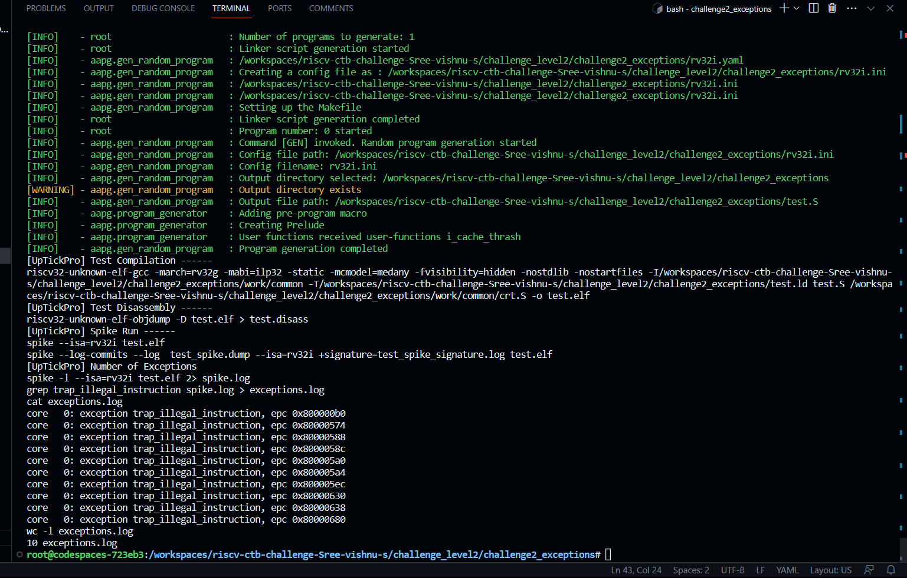

Firstly the copied the rv32i.yaml from above challenge 
by using that file , it generated only 1 illigal error 
so by changing intruction-disribution
around 10 exeption
it was set by modifying
  rel_sys: 0
  rel_sys.csr: 1
  rel_rv32i.ctrl: 0
  rel_rv32i.compute: 30
  rel_rv32i.data: 35
  rel_rv32i.fence: 30

It generated around 10 exception
