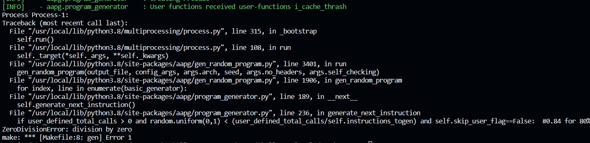
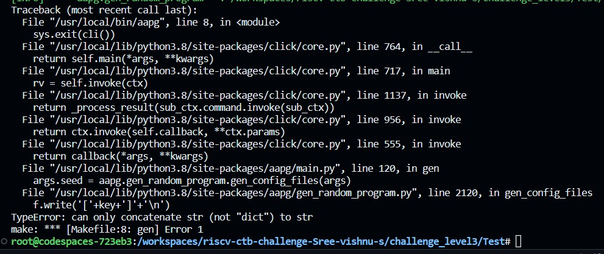

1)ZERO division error
    
    while running "random_test"
    On turning enabling recursion we are able too detect Zero division 
        recursion-options:
        recursion-enable: true
        recursion-depth: 10
        recursion-calls: 5

2) Can ony concatinate str to (not "dict") str error
    
    while running "Test"
        The error message "Can only concatenate str (not 'dict') to str" occurs when you try to concatenate a dictionary (dict object) to a string

3)Sring indices must be integers
    
    while running "Test2"
    The error message "TypeError: string indices must be integers" occurs when you try to use a string as an index to access elements in a data structure, like a list or a dictionary.
     However, string indices must be integers because strings themselves are not directly indexable using other strings.